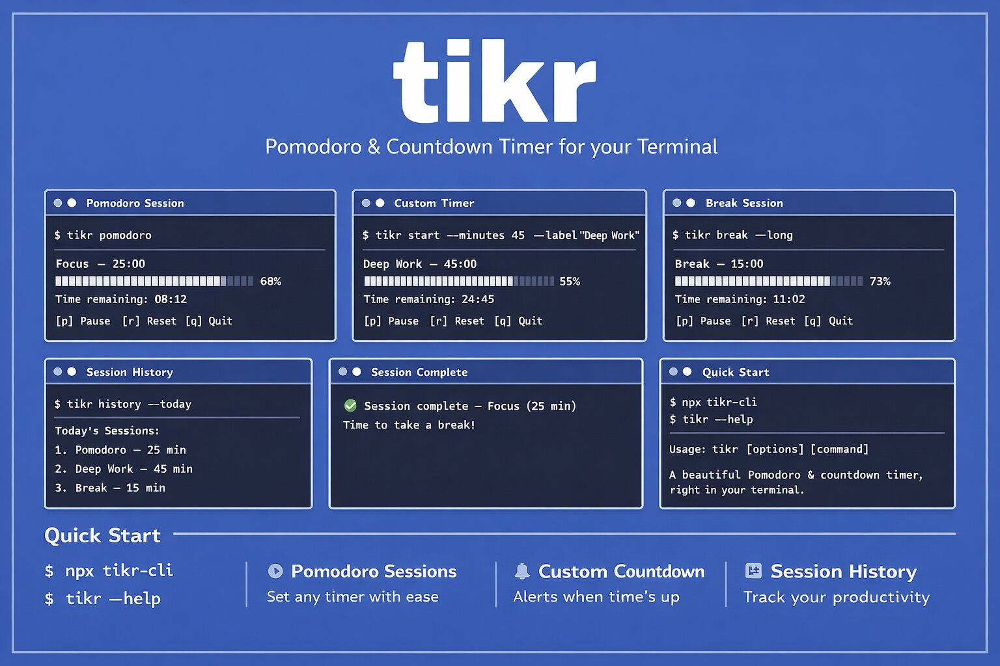

# tikr

A beautiful Pomodoro & countdown timer, right in your terminal.

## Features

- **Pomodoro mode** — 25-min work sessions with short & long breaks.
- **Custom countdown** — run any timer with a single command.
- **Interactive menu** — pick a session type without memorizing commands.
- **ASCII progress bar** — live visual countdown with pause and reset controls.
- **Desktop notifications** — alerts you when time is up.
- **Session history** — completed sessions logged to `~/.tikr/history.json`.
- **Colorized output** — clean, readable terminal UI.

## Install

Run instantly:

```bash
npx tikr-cli
```

Or install globally:

```bash
npm i -g tikr-cli
```

**Requirements:** Node.js >= 18

## Quick Start

```bash
# Launch the interactive menu
tikr

# Start a 25-min Pomodoro session
tikr pomodoro

# Run a custom countdown
tikr start --minutes 45 --label "Deep work"

# Take a short or long break
tikr break
tikr break --long

# View session history
tikr history --today
```

## CLI Reference

```text
Usage: tikr [options] [command]

A beautiful Pomodoro & countdown timer, right in your terminal

Options:
  -v, --version    Show current version
  -h, --help       Show help

Commands:
  pomodoro         Start a 25-minute Pomodoro session
  start            Start a custom countdown timer
  break            Start a break timer (5 min short, 15 min long)
  history          View session history
```

### start

```text
Options:
  -m, --minutes <number>   Duration in minutes (default: 25)
  -l, --label <text>       Label for the session (default: "Focus")
  --no-notify              Disable desktop notification on completion
  --no-sound               Disable sound on completion
  -q, --quiet              Suppress all output except the timer
```

### break

```text
Options:
  --long                   Use long break duration (15 min)
  --no-notify              Disable desktop notification on completion
  --no-sound               Disable sound on completion
```

### history

```text
Options:
  --today                  Show only today's sessions
  --clear                  Clear all session history
```

## Timer Controls

While a timer is running:

| Key | Action                 |
| --- | ---------------------- |
| `p` | Pause / resume         |
| `r` | Reset to full duration |
| `q` | Quit                   |

## Example Output

### Running timer

```text
  ⏱  Focus — 25:00
  ████████████████████░░░░░░░░░░  64%
  Time remaining: 09:02
  Press [p] to pause · [r] to reset · [q] to quit
```

### Session complete

```text
  ✅ Session complete — Focus (25 min)
  🔔 Time to take a break!
```

## Session Log

Completed sessions are saved to `~/.tikr/history.json`:

```json
[
  {
    "type": "pomodoro",
    "label": "Deep work",
    "duration": 25,
    "completedAt": "2026-03-13T10:45:00.000Z"
  }
]
```

## Module Structure

```text
src/
├── commands/   pomodoro, start, break, history
├── ui/         Ink timer component, banner, run-timer
├── lib/        history, notify, sound
└── index.ts    Commander bootstrap + interactive menu
```

## Dev

```bash
pnpm install
pnpm dev
pnpm test
pnpm build
```

## Stack

- TypeScript
- Commander.js
- Ink
- picocolors
- figlet
- node-notifier
- Vitest
- tsup
- pnpm

## License

Apache-2.0 © [Ashar Irfan](https://x.com/MrAsharIrfan) built with [Command Code](https://commandcode.ai).
